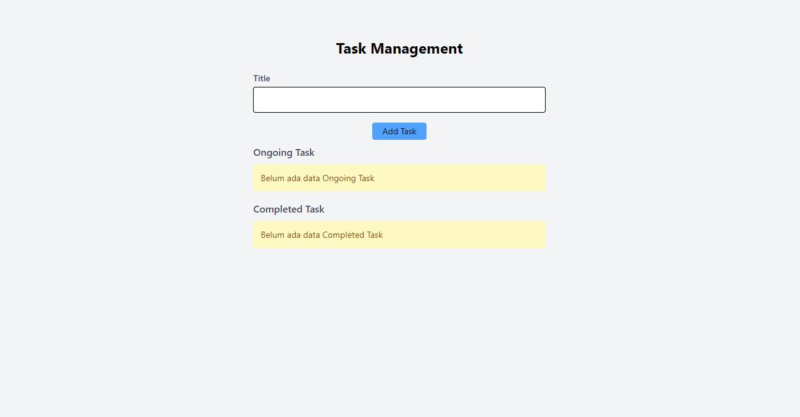

## pt-ihsan-solusi-informatika
Repositori ini digunakan untuk penilaian tes teknikal PT Ihsan Solusi Informatika

> Info !!
> Repositori ini hanya akan dibuka untuk umum bila diperlukan dan akan segera ditutup.

### 🚀 Cara menjalankan Docker

1. Setelah program ini berhasil di clone, jalankan perintah docker compose berikut: `docker-compose up --build -d`
2. Jika ingin menghentikan docker compose, jalankan perintah berikut: `docker-compose down`